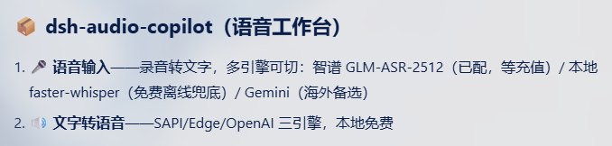
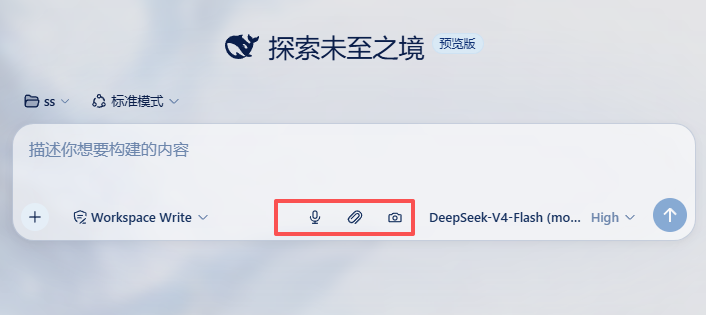
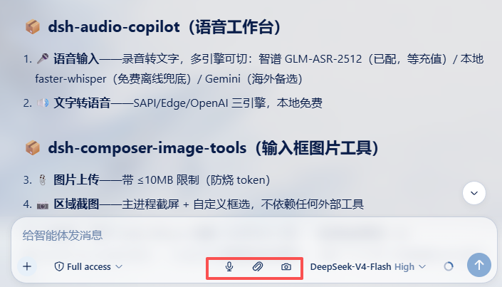

# 🎙️ dsh-audio-copilot · 语音工作台

> 给纯文本模型补上"听"和"说"的能力 —— DeepSeek Harness (DSH) 音频插件。
> **Audio Copilot: give your text-only agent ears and a voice.**

[](LICENSE)
[](https://github.com/deepseek-ai/deepseek-harness)
[](https://github.com/ai-yucheng/dsh-audio-copilot)

纯文本模型（如 DeepSeek-V4-Flash）天生**听不懂音频、说不出话**。本插件为它补齐这两块能力，并附赠一个**聊天框语音输入按钮**——对着麦克风说话，转成文字自动填入输入框，说完即发。

---

## 📖 目录

- [🎯 这是什么？](#-这是什么)
- [✨ 核心功能](#-核心功能)
- [🧠 工作原理](#-工作原理)
- [🚀 快速开始（小白向，3 分钟）](#-快速开始小白向3-分钟)
- [⚙️ 完整配置参考](#️-完整配置参考)
- [🧩 语音引擎怎么选？](#-语音引擎怎么选)
- [🎤 语音输入按钮使用教程](#-语音输入按钮使用教程)
- [🔧 Agent 工具使用](#-agent-工具使用)
- [❓ 常见问题 FAQ](#-常见问题-faq)
- [📸 示例截图](#-示例截图)
- [🤝 配套项目](#-配套项目)
- [📜 更新日志](#-更新日志)
- [📄 协议](#-协议)

---

## 🎯 这是什么？

| 能力 | 说明 |
|---|---|
| 🎤 **语音输入按钮** | 聊天输入框旁的麦克风按钮：点击 → 说话 → 自动转文字填入输入框。多引擎可选，中文/方言/外语通吃 |
| 📝 **audio_transcribe** | 让 Agent 自己把音频文件/录音转成文字（`/audio/transcriptions` 兼容端点） |
| 🔊 **audio_tts** | 让 Agent 把文字念出来：默认 **Windows 本地语音（SAPI），免 key 免联网**；可选 Edge 在线 / OpenAI 兼容端点 |
| 🔍 **audio_ask** | 带时间锚定的音频问答：转写 → 关键词定位 → 返回命中片段与时间戳（"3 分钟时说了什么？"） |
| 🧪 **audio_probe** | 用 ffprobe 读取音频元数据：容器 / 时长 / 编码 / 采样率 / 声道 |

适合：想让 DSH 听懂你的语音、给你朗读、分析录音的任何人。

---

## ✨ 核心功能

### 🎤 语音输入按钮（最常用）

- 浏览器端麦克风录音 → 服务端转写 → **文字自动填入输入框**
- 录音 UI：红色脉冲光晕 + 秒表计时 + 停止方块 + 转写 spinner
- 最长录音 **28 秒**（适配智谱 GLM-ASR 的 30 秒上限），到点自动停止
- 转写失败**大声提示**（错误信息可操作），绝不"没动静"；注入失败自动把结果复制到剪贴板

### 🧠 四引擎转写（自由切换，不锁定厂商）

| 引擎 | 特点 | 适用 |
|---|---|---|
| `zhipu` | **国内直连**，GLM-ASR-2512：中文普通话 + 四川/粤/闽/吴方言 + 数十种外语，CER 0.07 顶级，价格极低 | 🇨🇳 国内用户首选 |
| `local` | **本地 faster-whisper**：完全免费、无限用、离线、隐私 | 不花钱 / 离线场景 |
| `gemini` | 海外多模态，音频理解最强，免费档每时段 20 次限流（429 自动重试） | 海外网络 / 最强语义 |
| `openai` | 任意 OpenAI 兼容 `/audio/transcriptions` 端点（Whisper / SenseVoice 等） | 已有第三方端点 |

### 🔊 三引擎朗读（TTS）

- `sapi`（默认）：Windows 自带语音，**免费离线**，中文"Microsoft Huihui"、英文"Microsoft Zira/David"
- `edge`：微软在线 TTS，免 key（需网络可达 speech.platform.bing.com）
- `openai`：任意 OpenAI 兼容 `/audio/speech` 端点

### 🛡️ 可靠性设计

- Gemini 免费额度 429 限流 → **自动按提示等待后重试一次**
- 智谱拒 webm → **服务端 ffmpeg 自动转 16kHz wav**
- 缺 key / 缺 ffmpeg / 端点错误 → 可操作的中文错误信息
- 全部注册走 effect，卸载自动注销；Config 有 schema 校验

---

## 🧠 工作原理

```
┌──────────────────────── 浏览器端 (dsh.client) ────────────────────────┐
│  聊天输入框工具栏 ── 🎤 按钮                                            │
│    getUserMedia 录音 → MediaRecorder → webm Blob                       │
│        │                                                               │
│        └── POST /audio-copilot/transcribe (multipart)                  │
└───────────────┬────────────────────────────────────────────────────────┘
                ▼
┌──────────────────────── 服务端 (cordis 插件) ──────────────────────────┐
│  /audio-copilot/transcribe 路由                                        │
│    ├─ zhipu  : ffmpeg webm→wav → 智谱 GLM-ASR-2512 (OpenAI 兼容)       │
│    ├─ local  : python transcribe.py (faster-whisper, CPU int8)         │
│    ├─ gemini : curl → Gemini generateContent (多模态直吃 webm)          │
│    └─ openai : fetch → 任意兼容 /audio/transcriptions                   │
│    └─ 返回 { text, language }                                          │
└───────────────┬────────────────────────────────────────────────────────┘
                ▼
┌──────────────────────── 浏览器端 ──────────────────────────────────────┐
│  文字自动填入输入框(模拟粘贴事件,走 DSH 官方 pasteBegin 通道,React 兼容) │
└────────────────────────────────────────────────────────────────────────┘
```

---

## 🚀 快速开始（小白向，3 分钟）

### 第 0 步：确认前置

- **DSH Desktop** 已安装（本插件基于 DSH 0.1.0-rc.7 线）
- **Node.js ≥ 20**（DSH 自带 runtime，一般无需另装）
- **ffmpeg / ffprobe** 在 PATH（Windows 到 [gyan.dev](https://www.gyan.dev/ffmpeg/builds/) 下载 full build 解压，把 `bin` 加进系统 PATH）—— TTS(sapi) 不需要，但语音输入/转写需要

### 第 1 步：安装插件

在 DSH 的 profile web 目录（如 `C:\Users\<你>\Desktop\Harness测试\.dsh\profiles\web`）执行：

```bash
# 方式 A：GitHub 源码（推荐，可迭代）
git clone https://github.com/ai-yucheng/dsh-audio-copilot.git
pnpm add dsh-audio-copilot@link:C:/绝对路径/dsh-audio-copilot

# 方式 B：npm（若已发布）
pnpm add dsh-audio-copilot
```

然后在 profile 的 `package.json` → `dsh.profile.bundles` 数组里追加：

```json
"dsh-audio-copilot"
```

### 第 2 步：配置 API Key（按你选的引擎）

**🇨🇳 智谱引擎（推荐，国内直连）**：
1. 注册 [bigmodel.cn](https://bigmodel.cn)（手机号 + 实名）
2. 控制台 → API Keys → 创建 Key（形如 `xxxxxxxx.yyyyyyyyyy`）
3. 充值少量余额（语音输入按量计费，10-20 元够用很久）
4. 把 Key 写入环境变量 `ZHIPU_API_KEY`（Windows：`setx ZHIPU_API_KEY "你的key"`，或写进 `~/.dsh/.credentials.yaml`）

**🌐 Gemini 引擎（海外）**：
1. 访问 [Google AI Studio](https://aistudio.google.com/)（需代理）
2. 获取 API Key → 写入 `GEMINI_API_KEY`
3. 免费档每时段 20 次请求；付费档无此限制

**💻 本地引擎（免费离线）**：
```bash
pip install faster-whisper
# 建目录放脚本(用仓库自带的一份):
mkdir -p C:/Users/<你>/dsh-local-asr
cp docs/local-asr/transcribe.py C:/Users/<你>/dsh-local-asr/
# 首次转写会自动下载模型(~460MB small / ~1.5GB medium),之后离线可用
```

### 第 3 步：配置引擎（cordis.patch.yml）

在 profile 的 `cordis.patch.yml` 追加：

```yaml
- id: audio-copilot
  config:
    asrEngine: zhipu          # zhipu | local | gemini | openai
    asrBaseUrl: https://open.bigmodel.cn/api/paas/v4
    asrModel: glm-asr-2512
    asrApiKeyEnv: ZHIPU_API_KEY
    # 本地引擎时:
    localAsrRoot: C:/Users/<你>/dsh-local-asr
    localAsrModel: medium
```

### 第 4 步：重启 + 验证

1. **重启 DSH Desktop**（服务端路由生效）
2. **硬刷新浏览器** Ctrl+Shift+R（客户端按钮生效）
3. 聊天框工具栏出现 🎤 按钮 → 点击说话 → 文字填入输入框 → 🎉

验证命令：

```bash
dsh --profile web --dump-config | grep audio-copilot
```

---

## ⚙️ 完整配置参考

| 键 | 默认 | 说明 |
|---|---|---|
| `asrEngine` | `gemini` | 语音转写引擎：`zhipu` / `local` / `gemini` / `openai` |
| `asrBaseUrl` | `https://open.bigmodel.cn/api/paas/v4` | zhipu/openai 引擎端点根 |
| `asrModel` | `glm-asr-2512` | zhipu/openai 引擎模型名 |
| `asrApiKeyEnv` | `ZHIPU_API_KEY` | zhipu/openai 引擎持 key 的环境变量名 |
| `geminiApiKeyEnv` | `GEMINI_API_KEY` | gemini 引擎 key 环境变量 |
| `geminiModel` | `gemini-3.6-flash` | gemini 引擎模型 |
| `geminiBaseUrl` | `https://generativelanguage.googleapis.com` | gemini 端点根 |
| `geminiProxy` | `http://127.0.0.1:7890` | gemini 代理（海外直连无需配） |
| `localAsrRoot` | *(空)* | 本地引擎目录（含 `transcribe.py`） |
| `localAsrModel` | `medium` | 本地 whisper 模型：tiny/base/small/medium/large-v3 |
| `localAsrThreads` | `4` | 本地转写 CPU 线程数 |
| `localAsrPrompt` | *(空)* | 本地引擎专有名词提示（逗号分隔，如 `DeepSeek, DSH, 智能体`），显著提升术语识别 |
| `ttsEngine` | `sapi` | TTS 引擎：`sapi`(本地) / `edge`(在线) / `openai`(兼容端点) |
| `ttsBaseUrl` | `https://open.bigmodel.cn/api/paas/v4` | openai 引擎端点根 |
| `ttsModel` | `glm-tts` | openai 引擎模型 |
| `ttsApiKeyEnv` | `ZHIPU_API_KEY` | openai 引擎 key 环境变量 |
| `ttsVoice` | `Microsoft Huihui Desktop` | 默认音色 |
| `maxAudioBytes` | `26214400` | 转写文件大小上限（25MB） |
| `transcribeTimeoutMs` | `120000` | ASR 超时（毫秒） |
| `ttsTimeoutMs` | `90000` | TTS 超时 |
| `maxSegments` | `20` | audio_ask 返回命中片段上限 |

---

## 🧩 语音引擎怎么选？

| 你的情况 | 推荐引擎 | 理由 |
|---|---|---|
| 🇨🇳 国内网络、要方言/外语 | **`zhipu`** | 国内直连无墙；中文+四川/粤/闽/吴方言+数十种外语；按量计费极便宜 |
| 💰 不想花钱、离线优先 | **`local`** | faster-whisper 免费无限用，隐私（音频不出本机）；medium 模型中文准确 |
| 🌐 有代理、要最强语义理解 | **`gemini`** | 音频理解能力顶级；免费档限流，付费档 ~3厘/分钟 |
| 🔌 已有第三方 ASR 端点 | **`openai`** | 任何 OpenAI 兼容 `/audio/transcriptions` |

> 💡 换引擎只需改 `cordis.patch.yml` 的 `asrEngine` + 重启，不影响其他功能。

---

## 🎤 语音输入按钮使用教程

1. 点击工具栏 🎤 按钮 → 按钮变红色脉冲 + 秒表计时（`0:07`）
2. **允许浏览器使用麦克风**（首次会弹权限）
3. 对着麦克风说话（最长 28 秒，自动停止）
4. 点击 ⏹ 停止 → 按钮变 spinner（"转写中…"）
5. 文字**自动填入输入框** → 按 Enter 发送

> 如果转写结果没能自动填入（极端情况），会弹出提示并把文字复制到剪贴板，直接 Ctrl+V 粘贴即可。

---

## 🔧 Agent 工具使用

在 DSH 会话里直接对 Agent 说：

```
「把这个录音转成文字：C:\meeting.wav」         → audio_transcribe
「把"你好世界"读出来」                          → audio_tts（本地 SAPI）
「这个会议录音 3 分钟的时候说了什么？」          → audio_ask
「看看这个音频的格式和时长」                    → audio_probe
```

`audio_transcribe` 支持：本地文件路径、DSH 上传的音频附件、浏览器录音。引擎与 🎤 按钮共用同一套配置。

---

## ❓ 常见问题 FAQ

**Q：按钮不出现？**
重启 DSH + 硬刷新浏览器；确认 `dsh.profile.bundles` 已加 `dsh-audio-copilot`。

**Q：点了按钮没反应？**
确认麦克风权限已允许；看按钮是否弹出错误提示（如"转写失败:xxx"）。录音需 ffmpeg（zhipu 引擎转 wav）。

**Q：转写失败"余额不足"？**
智谱引擎需要在 [bigmodel.cn](https://bigmodel.cn) 充值；其他引擎检查对应 key。

**Q：转写失败 429？**
Gemini 免费档每时段 20 次限流，已自动重试一次；建议换 zhipu/local 引擎。

**Q：识别不准（专有名词错）？**
- 本地引擎：配置 `localAsrPrompt`（如 `DeepSeek, DSH, 智能体`），实测显著提升
- 智谱引擎：GLM-ASR 支持自定义词典，可加专有名词

**Q：录音时长有限制吗？**
28 秒自动停止（智谱 ASR 限 30 秒）。长录音用 `audio_transcribe` 工具转本地文件，无此限制。

**Q：粤语/方言能识别吗？**
- 智谱 GLM-ASR-2512：支持四川/粤/闽/吴等方言 ✅
- 本地 whisper：方言效果一般（whisper 弱项），粤语建议换 zhipu 引擎

---

## 📸 示例截图

| 语音工作台 | 使用界面 | 工具栏按钮 |
|---|---|---|
|  |  |  |

---

## 🤝 配套项目

同系列 DSH 插件（均为自研，开源）：

- [**dsh-composer-image-tools**](https://github.com/ai-yucheng/dsh-composer-image-tools) —— 聊天输入框图片工具：📎 上传图片（≤10MB 防烧 token）+ 📷 自定义区域截图（Electron desktopCapturer，不依赖任何外部工具）。与 🎤 按钮同栏并排。

---

## 📜 更新日志

详见 [CHANGELOG.md](CHANGELOG.md)。关键里程碑：

- `0.1.0` — 四引擎转写（zhipu/local/gemini/openai）、语音输入按钮、429 自动重试、webm 自动转 wav、本地 faster-whisper 部署、React 兼容的文字注入

---

## 📄 协议

MIT © [ai-yucheng](https://github.com/ai-yucheng)
